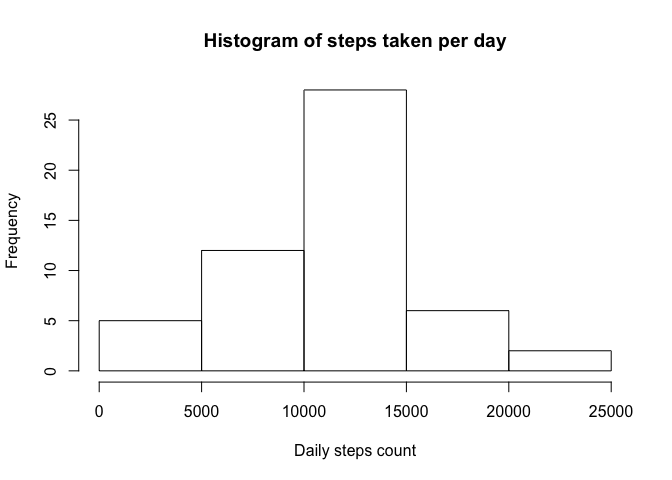
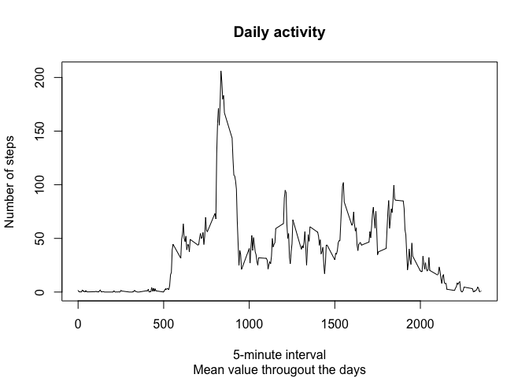
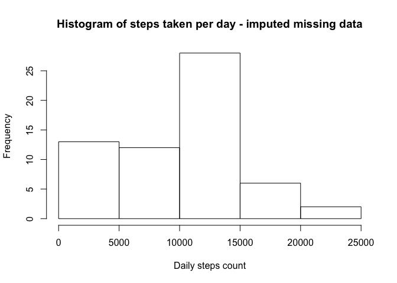
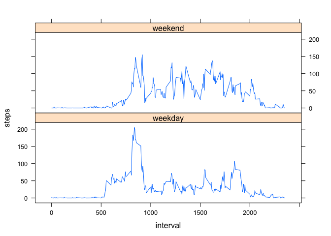

# Reproducible Research: Peer Assessment 1

## Loading and preprocessing the data
- unzipping input data
- reading csv file

```r
if (!file.exists("activity.csv"))
  unzip("activity.zip")
dt <- read.csv("activity.csv")
```


## What is mean total number of steps taken per day?
- sum steps taken per day
- removing missing data while plotting histogram and calculating mean and median

```r
steps_by_date <- with(dt,tapply(steps,date,sum))
hist(steps_by_date, breaks=6, xlab='Daily steps count', main=paste("Histogram of","steps taken per day"))
```

<!-- -->

```r
mean(steps_by_date, na.rm=TRUE)
```

```
## [1] 10766.19
```

```r
median(steps_by_date, na.rm=TRUE)
```

```
## [1] 10765
```

## What is the average daily activity pattern?
- calculate mean value per every 5-minute interval

```r
daily_activity <- tapply(dt$steps, dt$interval, mean, na.rm=TRUE)
plot(x=names(daily_activity),y=daily_activity, type='l', xlab='5-minute interval', ylab='Number of steps', main='Daily activity', sub='Mean value througout the days')
```

<!-- -->

```r
max_interval <- daily_activity[daily_activity == max(daily_activity)]
```

Top 5-minute interval is interval nr. 835

## Imputing missing values
### Process data

```r
complete_rec <- dt[!is.na(dt$steps),]
missing <- dt[is.na(dt$steps),]
```
Total number of missing values is **2304**.

The method for imputing missing values is to calculate median values for each interval.
Imput missing steps counts according to respective interval.

```r
median_steps <- tapply(dt$steps, dt$interval, median, na.rm=TRUE)
missing[,1] <- median_steps[as.character(missing[,3])]
dtimp <- rbind(complete_rec, missing)
```


### Calculate daily activity with imputed data
- sum steps taken per day
- plot histogram
- calculate mean and median values

```r
steps_by_date_imp <- with(dtimp,tapply(steps,date,sum))
hist(steps_by_date_imp, breaks=6, xlab='Daily steps count', main=paste("Histogram of","steps taken per day - imputed missing data"))
```

<!-- -->

```r
mean(steps_by_date_imp)
```

```
## [1] 9503.869
```

```r
median(steps_by_date_imp)
```

```
## [1] 10395
```

## Are there differences in activity patterns between weekdays and weekends?
### Process data
- find out name of the day for the date
- map name of the day to factor variable with two factors (weekday, weekend)
- subset imputed data frame by this factor

```r
library(plyr)
dtimp$wday <- weekdays(as.Date(dtimp[,2]))
dnames <- c("Monday" = "weekday","Tuesday" = "weekday","Wednesday" = "weekday","Thursday" = "weekday","Friday" = "weekday","Saturday" = "weekend","Sunday" = "weekend")
dtimp$wcat <- as.factor(revalue(dtimp$wday,dnames))
```

**Calculate mean steps for each interval for the weekends**

```r
we <- subset(dtimp,wcat=="weekend")
weo <- tapply(we$steps,we$interval,mean)
df_weo <- as.data.frame(weo)
df_weo$wcat <- rep("weekend",length(weo))
df_weo$interval <- rownames(df_weo)
rownames(df_weo) <- NULL
colnames(df_weo) <- c("steps","wcat", "interval")
```

**Calculate mean steps for each interval for the weekdays and bind datasets into one**

```r
wd <- subset(dtimp,wcat=="weekday")
wdo <- tapply(wd$steps,wd$interval,mean)
df_wdo <- as.data.frame(wdo)
df_wdo$wcat <- rep("weekday",length(wdo))
df_wdo$interval <- rownames(df_wdo)
rownames(df_wdo) <- NULL
colnames(df_wdo) <- c("steps","wcat", "interval")

df_out <- rbind(df_wdo,df_weo)
df_out <- transform(df_out, wcat = factor(wcat), interval=as.numeric(interval))
```

### Plot steps by interval for each weekends and for weekdays separately

```r
library(lattice)
xyplot(steps ~ interval | wcat, data=df_out, layout = c(1,2), type='l')
```

<!-- -->
